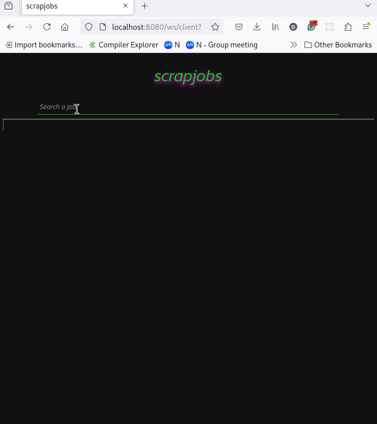

# scrapjobs

Scrapes over tech jobs websites, and provides a
nice search interface for it.

## Usage



The search is triggered on key pressed and throttled to preserve the backend.
On the backend we simply execute the search and return the results as JSON. In
the frontend again we swap generate HTML dynamically and replace `.innerHTML`.

### Keybinds

* `/` to jump to the search bar
* `<tab>` to cycle between links and tag inputs

### Search

* `rust backend` use simple words as terms 
* `golang backend -java` use `-` before a word to remove it from the search
* `golang #new` use `#` before a words to search for a tag

### Local tags

* Use `!sometag` in the `>___` input aside each vacancy to add a local tag.
* Use `-sometag` in the `>___` input aside each vacancy to iremove a local tag `!sometag`
    * Local tags are saved in the browser, use it to bookkeep your applications. 

## The data ETL

To populate the database I downloaded the jobs from public available sources,
I didn't used any authenticated session to download the data, the datata is not
shared in the repository for obvious reasons anyway.

To download the data I do it in 3 steps, each step receives the output of
the previous step. All steps outputs are in JSON.

1. Run the getLinks scrappers: `node scrap.mjs getLinks`. This scrapper
   outptus a list of links in JSON format. It must open the browser, get the
   links and output as JSON.
2. Run the dowloadData scrappers ` .. links json .. | node scrap downloadLinks
 rustjobs rust rustjobs othertag`. These scrappers get the links from the
   previous step, download the data from each link and save in the `output/.`
   folder. It outputs the files saved as a JSON string array
3. Run the importer. ` .. output json files .. | (cd tools/; go run .)` This is
   not a scrapper. It reads the list of files generated in the previous step
and load it into the database. The `new` tag is cleared for old entries, and
new entries are inserted with the `new` tag setted.

Running all steps at once:

```
node scrap.mjs getLinks | \
  node scrap downloadLinks | \
  (cd tools/; go run .)
```

This will scrap and insert new entries in the database, updating the
`new` tags accordingly.

## The Backend

The backend lives in `backend/web-service-gin` folder. I'm using gin framework.
The backend has only one endpoints where the user can send a query or the websocket
at `/ws/server`. The `/` loads `index.html` a pure HTML client that
render searches interactively.

## The Database

I'm using Postgres with [full-text search](https://www.postgresql.org/docs/current/textsearch.html).
At each keystroke in the frontend (after being throttled), the search is sent to the backend. The
backend then interprets thje proper query, run and returns the JSON.

The database schema is in `db.sql` for now, you need it in order to create the database.


# TODO

* Improve the first-time setup 
